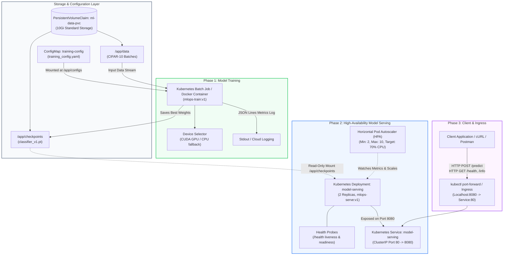

# Assignment 3: Samuel Paul Pushparaj P (DA25M615)

## AI - assitance was used, refinement, environment setup and reporting was done individually with complete understanding of the assignment

## Architecture Diagram



---

## Project Structure

```text
mlops-pytorch-pipeline/
├── .github/
│   └── workflows/
│       └── ci.yml               # Automated CI for linting, pytest, and Docker verification
├── configs/
│   └── training_config.yaml     # Hyperparameters, paths, and early stopping configs
├── docker/
│   ├── Dockerfile.train         # Optimized multi-stage build for training workloads
│   └── Dockerfile.serve         # Hardened, slim non-root container for model serving
├── k8s/
│   ├── namespace.yaml           # Isolated 'ml-training' namespace
│   ├── configmap.yaml           # ConfigMap holding training_config.yaml
│   ├── pvc.yaml                 # PersistentVolumeClaim for datasets and checkpoints
│   ├── training-job.yaml        # Batch Job manifest with resource limits & GPU toleration
│   ├── serving-deployment.yaml  # 2-replica Deployment with liveness & readiness probes
│   ├── serving-service.yaml     # Service exposing port 80 -> 8080
│   └── hpa.yaml                 # Horizontal Pod Autoscaler based on CPU metrics
├── requirements/
│   ├── train.txt                # Pinned training dependencies
│   └── serve.txt                # Pinned lightweight inference dependencies
├── src/
│   ├── dataset.py               # CIFAR-10 data loaders & augmentation pipeline
│   ├── model.py                 # ResNet-18 & custom CNN model definitions
│   ├── train.py                 # Training loop with JSON metrics & early stopping
│   └── serve.py                 # High-performance FastAPI server (/health, /predict)
├── tests/
│   ├── __init__.py
│   ├── sample_image.png         # Airplane sample image for model prediction
│   └── test_model.py            # Unit tests for shapes, forward pass, and API
├── scripts/
│   ├── setup_git_branches.sh    # Git workflow automation script
│   └── run_local_docker.sh      # Local Docker build and run script
├── .gitignore
├── Architecture.png
└── README.md
```

---

##Quickstart: Local Development

### 1. Prerequisites
- Python 3.11+
- Docker Desktop or Docker daemon
- kubectl & Kubernetes cluster (Minikube / kind / cloud)

### 2. Python Environment Setup
```bash
# Create virtual environment, example uses conda and gitbash
conda create -n mlops312 python=3.12
conda init bash #restart git bash
conda activate mlops312

# Install training dependencies
pip install -r requirements/train.txt

# Run unit tests
pytest tests/ -v
```

### 3. Local Training
```bash
python src/train.py
```

---

##Docker Execution

### 1. Build Multi-Stage Training Image
```bash
docker build -f docker/Dockerfile.train -t mlops-train:v1 .
```

### 2. Run Containerized Training with Volume Mounts
```bash
mkdir -p data checkpoints
docker run --rm \
  -v $(pwd)/data:/app/data \
  -v $(pwd)/checkpoints:/app/checkpoints \
  mlops-train:v1
```

### 3. Build Serving Image
```bash
docker build -f docker/Dockerfile.serve -t mlops-serve:v1 .
```

### 4. Run Model Serving Container
```bash
docker run --rm -d \
  -p 8080:8080 \
  -v $(pwd)/checkpoints:/app/checkpoints:ro \
  --name mlops-serving \
  mlops-serve:v1
```

### 5. Test Serving Endpoints
```bash
# Health check
curl http://localhost:8080/health

# Prediction endpoint
curl -X POST http://localhost:8080/predict \
  -F "image=@tests/sample_image.png"
```

---

## Kubernetes Deployment

### 1. Deploy Namespace, ConfigMap & Storage
```bash
kubectl apply -f k8s/namespace.yaml
kubectl apply -f k8s/configmap.yaml
kubectl apply -f k8s/pvc.yaml
```

### 2. Run Training Job
```bash
kubectl apply -f k8s/training-job.yaml

# Follow training logs in JSON lines format
kubectl logs -f job/pytorch-training-job -n ml-training
```

### 3. Deploy Model Serving & Autoscaling
```bash
kubectl apply -f k8s/serving-deployment.yaml
kubectl apply -f k8s/serving-service.yaml
kubectl apply -f k8s/hpa.yaml

# Check pod statuses
kubectl get pods -n ml-training
```

### 4. Port Forward and Test
```bash
# Port-forward service to localhost
kubectl port-forward svc/model-serving 8080:80 -n ml-training

# Test prediction
curl -X POST http://localhost:8080/predict -F "image=@sample_image.png"
```
